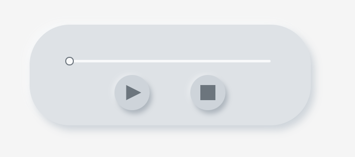

# vscode-sound-player

## 描述

本插件用于在 vscode 环境中播放对应文件音频

## 功能

- 播放/暂停
- 停止
- 时间进度条

## 预览

## 技术点

- webview 端使用[React](https://react.docschina.org/languages)
- webview 端使用[audio-file-decoder](https://github.com/aeroheim/audio-file-decoder)解码

## 问题

`audio-file-decoder`目前在解码部分音频时仍存在问题，请以专业播放器播放的效果为准。

## 提示

如果你也在开发 vscode 的插件，并且需要在 webview 端播放声音但发现无法播放声音，那么这边有一种途径是可行的(也就是本插件正在使用的)。插件自己对音频进行解码并使用[audio context](https://developer.mozilla.org/en-US/docs/Web/API/AudioContext)api 进行播放。

## 额外

如果你有知道有其他 js 音频解码的库，欢迎给我提[issue](https://github.com/asurance/vscode-sound-player/issues)。
对库的要求是能获取到音频的采样率，采样帧数，通道数和每个通道内的音频数据。
